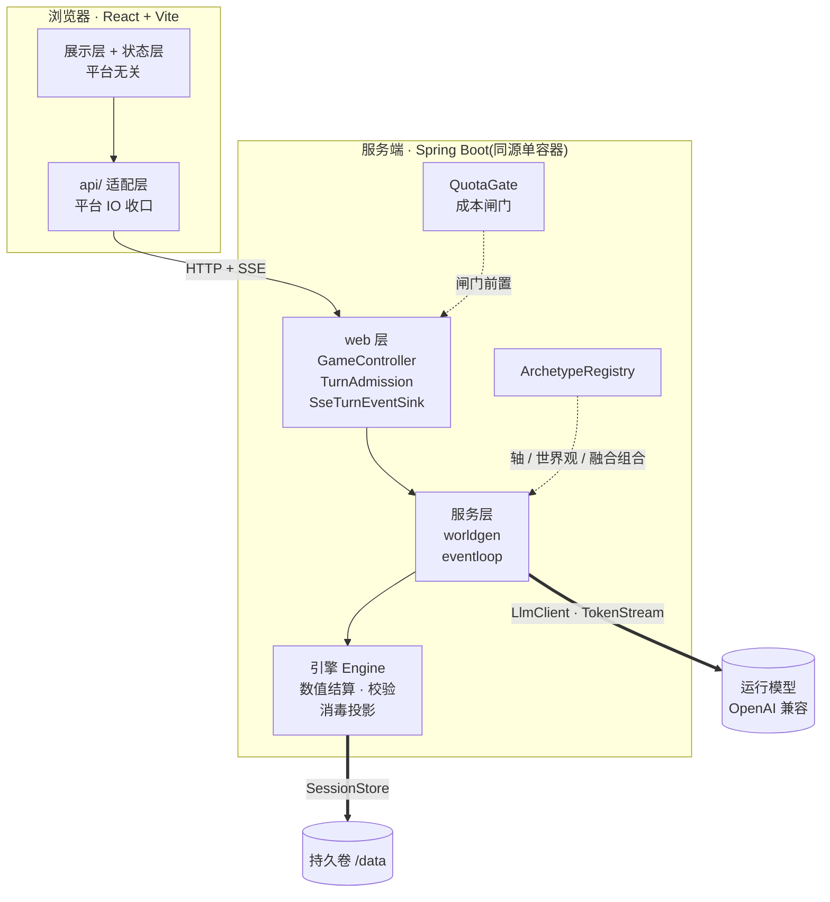

# 架构图

一张图讲**结构**:有哪些层、谁调用谁、可换的东西在哪条缝上。

> **图不是真理源。** 每一格的裁定正文在对应 ADR 里,本文件只画它们的相对位置;
> 两者对不上时**以 ADR 与源码为准**,回来改图。
>
> **世界目录不在这里**(有哪些世界、各自什么数值轴)—— 它会随 registry 变,
> 见 [README 的世界表](../README.md#世界)与其指向的登记处。

---

**粗线是接缝**:换 provider 只改配置表([ADR-001](adr/ADR-001-runtime-model-and-provider-abstraction.md)),
换传输只换 `api/` 与 `SseTurnEventSink`([ADR-003](adr/ADR-003-frontend-stack-and-taro-boundary.md) /
[ADR-005](adr/ADR-005-sse-web-stack-mvc-thin-seam.md)),
换落盘只换 `SessionStore` 实现([ADR-015](adr/ADR-015-overseas-deployment-form-factor.md))。

**虚线是「谁喂谁数据」**:引擎不认识任何一根数值轴的名字,轴语义由 registry 在播种时传进去
([ADR-008](adr/ADR-008-multi-mode-extension-architecture.md));加一个世界的落点因此是
`ArchetypeRegistry` 的一条元数据,不动引擎。
