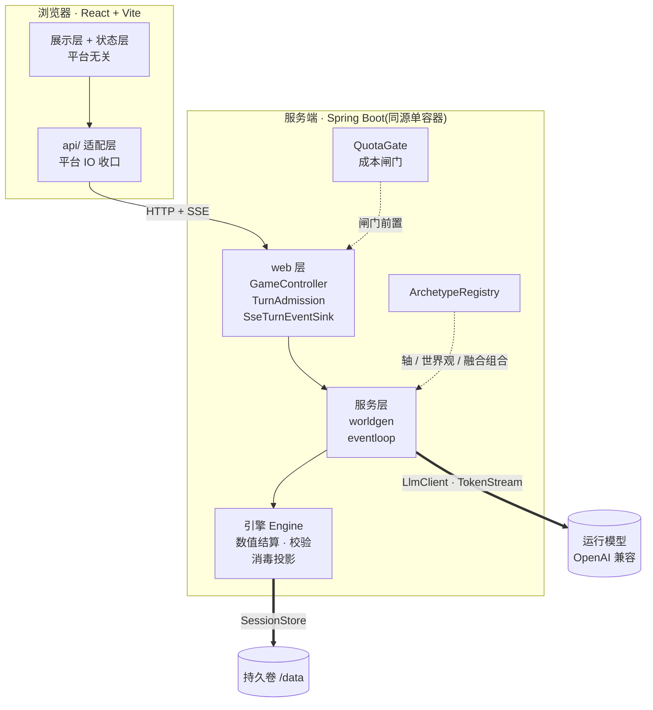
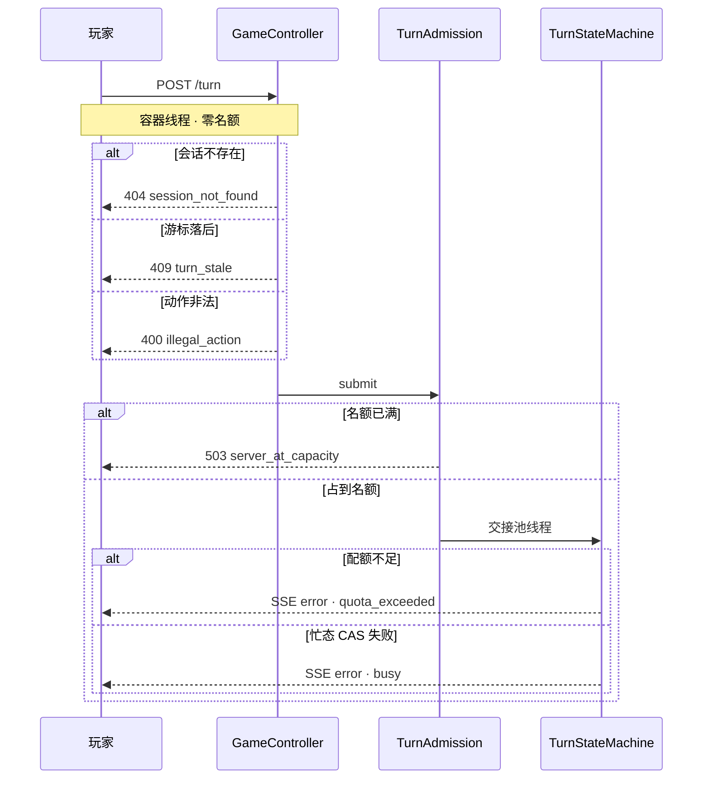
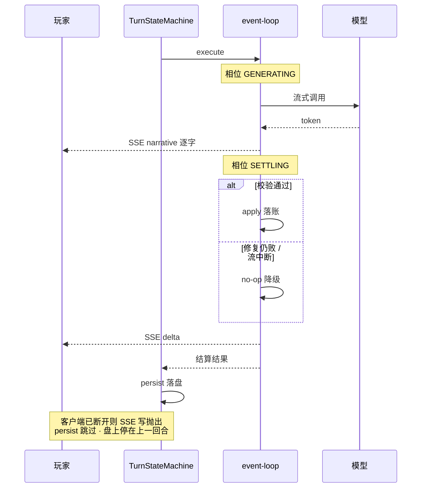

# 架构图与回合时序图

- **结构** —— 有哪些层、谁调用谁、可换的东西在哪条缝上。
- **一次回合的生命周期** —— 拆成「没跑成」与「跑成了」两节:同一个请求,前者停在某一格,后者走完。

> **图不是真理源。** 每一格的裁定正文在对应 ADR 与源码里,本文件只画它们的相对位置;
> 两者对不上时**改图,不改那里**。
> ⚠️ 其中拒绝链那一张另有一个更具体的宿主,见该节开头的注 —— **泛指「ADR 与源码」接不住它**。
>
> **世界目录不在这里**(有哪些世界、各自什么数值轴)—— 它会随 registry 变,
> 见 [README 的世界表](../README.md#世界)与其指向的登记处。

---

## 一 · 结构

**粗线是接缝**:换 provider 只改配置表([ADR-001](adr/ADR-001-runtime-model-and-provider-abstraction.md)),
换传输只换 `api/` 与 `SseTurnEventSink`([ADR-003](adr/ADR-003-frontend-stack-and-taro-boundary.md) /
[ADR-005](adr/ADR-005-sse-web-stack-mvc-thin-seam.md)),
换落盘只换 `SessionStore` 实现([ADR-015](adr/ADR-015-overseas-deployment-form-factor.md))。

**虚线是「谁喂谁数据」**:引擎不认识任何一根数值轴的名字,轴语义由 registry 在播种时传进去
([ADR-008](adr/ADR-008-multi-mode-extension-architecture.md));加一个世界的落点因此是
`ArchetypeRegistry` 的一条元数据,不动引擎。

---

## 二 · 一次回合:没跑成(拒绝链)

> ⚠️ **本图是副本,不是宿主。** 拒绝链的立字宿主是
> [`GameController.turn`](../server/src/main/java/com/aiuniverse/server/web/GameController.java)
> 的 javadoc 里那张 ASCII 图(ADR-022 立字 6 起迁到那里);
> **两者对不上时改本图,不改那里。**
>
> 它仍值得画,是因为**线程边界与名额占用**在 ASCII 那张里表达不出来 —— 但这不改变它是第二份渲染。
> ⚠️ 两者之间**没有 lockstep 守护**:改了 javadoc 而忘了改本图,今天**不会有任何东西变红**
> (挂账见[求职线层 0](backlog-career-track.md),与 README ↔ `ArchetypeRegistry` 那条同形)。

**容器线程那几格零名额**:必须在领池线程之前拒掉 —— 让一个必然被拒的请求先占一个名额再还回来,
是白白让真玩家少一个位子([ADR-022](adr/ADR-022-turn-admission-and-rejection-semantics.md) 立字 7)。

**游标比对排在合法性之前**([ADR-023](adr/ADR-023-turn-cursor-idempotency.md) 立字 1):两者都是纯读,
排序纯是语义问题 —— 游标落后时,守卫 1 是**在一个过期的前提上做判断**。

---

## 三 · 一次回合:跑成了

**出网那几条实际经 `SseTurnEventSink`**(图上直接画成 event-loop → 玩家,略去那层薄适配);
经它出网的状态**必须已过消毒投影**,隐藏字段不下发。

**最后那条注是 [ADR-023](adr/ADR-023-turn-cursor-idempotency.md) 的病因**:客户端断开 →
SSE 写抛出 → `persist` 被跳过,于是**内存已经是 N+1 而盘上还是 N**。玩家再点一次,
他手里那组旧选项的 id 跨回合稳定,守卫 1 照样认得 —— 那就是 §二 里 `turn_stale` 那一格要拦的东西。
